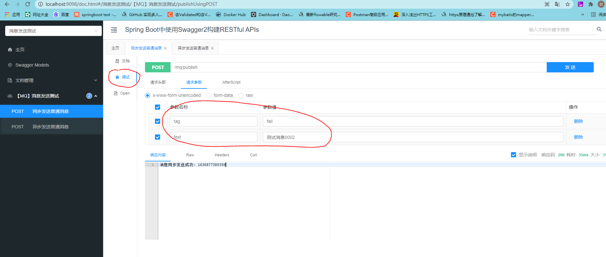
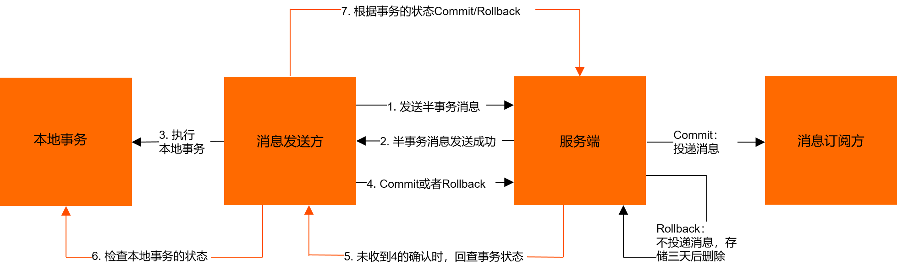

> mymq-spring-boot-starter 测试 Demo


本次以 Rabbitmq为例子

# 步骤1 下载依赖，本地 mvn clean install

https://gitee.com/banana6/mq-spring-boot-starter

```xml
<dependency>
    <groupId>com.guzt</groupId>
    <artifactId>mymq-spring-boot-starter</artifactId>
    <version>1.2-SNAPSHOT</version>
</dependency>
```

# 步骤2 本springboot测试工程确保连接上 rabbitmq
本项目里面的 application.yml中
```yaml
guzt:
  mq:
    amqp:
      rabbitmq:
        enable: true
        user-name: 你的mq用户名
        password: 你的mq密码
        host: 你的mq连接ip地址
        port: 你的mq端口
        virtualHost: 你的mq的virtualHost

```

# 启动测试项目，访问 http://localhost:9098/doc.html



**本测试项目，根据application.yml文件中的配置，一共启动了1个消息发送者，两个消息消费者**

这两个消费这属于不同的消费群组（`配置的 groupId不一样`） ,如果你希望消费者属于一个集群，消费负载均衡的进行，
则需要将groupId的值设置为一样，另外必须 监听器里面的 tag  topicName 必须一致！

例如下面的监听器 MySubscriber2ServiceListener：
```java
@Component
public class MySubscriber2ServiceListener implements TopicListener {
    @Override
    public String getSubscriberBeanName() {
        // 注意！！！！ 【类的名称不要写成 MySubscriber2Service，mySubscriber2Service是消息消费者的Bean name】
        // 请确保和ymal文件中消息消费者中的 beanName 一致
        return "mySubscriber2Service";
    }

    @Override
    public String getTopicName() {
        // 订阅订单中心类的主题消息
        return "TOPIC-TEST001";
    }

    @Override
    public String getTagExpression() {
        // * 表示所有  || 表示订阅多个tag，例如  TAG-A||TAG-B||TAG-C
        return "*";
    }

    @Override
    public MessageStatus subscribe(TopicMessage topicMessage) {
        return MessageStatus.CommitMessage;
    }
}
```


点击【发送】按钮， 控制台可打印如下信息：
```text

MySubscriber2Service 消费消息 message body = 测试消息0002
2021-11-14 16:09:49.356  INFO 9664 --- [ool-1-thread-17] c.g.s.m.s.i.amqp.AmqpRabbitMqSubscriber  : 当前消费第0次，消息重新给重试队列等待重投.... topicName=TOPIC-TEST001, messageId=c817635feeb5453ba5509b203fb0a214617516, bussinessKey=1636877389339, routingKey=fail, groupId=QUE_BOOTTEST2_DEV
MySubscriber2Service 消费消息 message body = 测试消息0002
2021-11-14 16:09:59.368  INFO 9664 --- [ool-1-thread-18] c.g.s.m.s.i.amqp.AmqpRabbitMqSubscriber  : 当前消费第1次，消息重新给重试队列等待重投.... topicName=TOPIC-TEST001, messageId=c817635feeb5453ba5509b203fb0a214617516, bussinessKey=1636877389339, routingKey=fail, groupId=QUE_BOOTTEST2_DEV
MySubscriber2Service 消费消息 message body = 测试消息0002
2021-11-14 16:10:09.383  INFO 9664 --- [ool-1-thread-19] c.g.s.m.s.i.amqp.AmqpRabbitMqSubscriber  : 当前消费第2次，消息重新给重试队列等待重投.... topicName=TOPIC-TEST001, messageId=c817635feeb5453ba5509b203fb0a214617516, bussinessKey=1636877389339, routingKey=fail, groupId=QUE_BOOTTEST2_DEV
MySubscriber2Service 消费消息 message body = 测试消息0002
2021-11-14 16:10:19.396  INFO 9664 --- [pool-1-thread-8] c.g.s.m.s.i.amqp.AmqpRabbitMqSubscriber  : 当前消费第3次，消息重新给重试队列等待重投.... topicName=TOPIC-TEST001, messageId=c817635feeb5453ba5509b203fb0a214617516, bussinessKey=1636877389339, routingKey=fail, groupId=QUE_BOOTTEST2_DEV
MySubscriber2Service 消费消息 message body = 测试消息0002
2021-11-14 16:10:29.410  INFO 9664 --- [pool-1-thread-9] c.g.s.m.s.i.amqp.AmqpRabbitMqSubscriber  : 当前消费第4次，消息重新给重试队列等待重投.... topicName=TOPIC-TEST001, messageId=c817635feeb5453ba5509b203fb0a214617516, bussinessKey=1636877389339, routingKey=fail, groupId=QUE_BOOTTEST2_DEV
MySubscriber2Service 消费消息 message body = 测试消息0002
2021-11-14 16:10:39.422  INFO 9664 --- [ool-1-thread-11] c.g.s.m.s.i.amqp.AmqpRabbitMqSubscriber  : 当前消费第5次，消息超过最大重新投递次数5 ，直接消费完成！ topicName=TOPIC-TEST001, messageId=c817635feeb5453ba5509b203fb0a214617516, bussinessKey=1636877389339, routingKey=fail, groupId=QUE_BOOTTEST2_DEV


```

# 消费失败重试
yml文件中已经配置了 
例如： maxRetryCount: 3, retryConsumIntervalSeconds: 5
尝试消费失败重试3次，每次间隔5秒，如果超过这直接调用 MyRetryConsumFailHandler 里面的handle方法。

rabbitmq 是采用死信队列 + 消息超时机制实现消息消费失败重试。

rocketMq 自带消息消费失败重试机制。


# 分布式事务消息
分布式事务消息也成为半消息机制，来源于rockeMq， rockeMq本身支持分布式事务消息。
针对rabbitmq 利用死信队列和超时机制实现消息的回查机制。


**所谓半消息机制，解决分布式事务 总的思想步骤如下：**


参见：https://help.aliyun.com/document_detail/29548.html?spm=a2c4g.11186623.6.598.62ca4c0709fx2g


这里总的概况步骤：
1.  开启 MQ 事务，  txSelect();

2. publish msg 发送消息（此时消息不会对消费者可见）

3. 执行本地事务逻辑

4. 根据本地事务执行情况 MQ事务 commit 还是 rollback

5. MQ服务会定时回查本地事务，你需要告知MQ服务，本地事务到底成功了还是失败

具体本测试例子中定义了一个 分布式消息发送者 myXaPublisherService ，和一个消费者 myXaSubscriberService，
消费者和其他消费者一样，没有任何区别。

然后定义一个本地事务执行器 MyXaTopicLocalTransactionExecuter， 执行本地事务和提供消息回查机制。
本地事务执行器，继承下面的接口 XaTopicLocalTransactionExecuter
```java
/**
 * 发送半消息后，本地事务执行器
 * https://help.aliyun.com/document_detail/29548.html?spm=a2c4g.11186623.6.598.4b9e7e80WgS7Fs
 *
 * @author guzt
 */
public interface XaTopicLocalTransactionExecuter {


    /**
     * 本地事务执行器id, 一个应用启动一个事务消息的发送服务， 多个模块发送事务消息，每个模块对应一个 ExecuterId
     *
     * @return executerId
     */
    String getLocalTransactionExecuterId();


    /**
     * When send transactional prepare(half) message succeed, this method will be invoked to execute local transaction.
     *
     * @param msg           Half(prepare) message
     * @param businessParam Custom business parameter
     * @return Transaction state
     */
    LocalTransactionStatus executeLocalTransaction(XaTopicMessage msg, Object businessParam);

    /**
     * When no response to prepare(half) message. broker will send check message to check the transaction status, and this
     * method will be invoked to get local transaction status.
     *
     * @param msg Check message
     * @return Transaction state
     */
    LocalTransactionStatus checkLocalTransaction(XaTopicMessage msg);

}
```


测试参数 tag传递COMMIT 模拟正常成功情况

```text
2021-11-14 17:41:29.457  INFO 1016 --- [nio-9098-exec-5] c.g.s.m.s.i.a.AmqpXaRabbitMqPublisher    : 【MQ】AmqpXaRabbitMqPublisher[myXaPublisherService] , exchangeName[EX_XA_BOOTTEST_DEV] start...
2021-11-14 17:41:29.583  INFO 1016 --- [nio-9098-exec-5] c.g.s.m.s.i.a.AmqpXaRabbitMqPublisher    : 【MQ】AmqpRabbitMqSubscriber[myXaPublisherService_xa_check] , exchangeName[xa-check-letter-QUE-EX_XA_BOOTTEST_DEV]   started
2021-11-14 17:41:29.607  INFO 1016 --- [nio-9098-exec-5] com.test.xa.PayTestService               : 创建了支付订单..., 相关参数= {tag=COMMIT, message=分布式事务消息测试001}
2021-11-14 17:41:29.620  INFO 1016 --- [ool-1-thread-16] c.t.s.MyXaSubscriberServiceListener      : 【分布式事务消息】MyXaSubscriberServiceListener 消费消息 message body = 分布式事务消息测试001, 本地事务执行器唯一编号= BUSINESS_XA_EXECUTER_001
2021-11-14 17:41:59.598  INFO 1016 --- [ool-1-thread-17] com.test.xa.PayTestService               : 模拟最终查询事务提交...
2021-11-14 17:41:59.598  INFO 1016 --- [ool-1-thread-17] c.g.s.m.s.i.a.AmqpXaRabbitMqPublisher    : 当前XA事务消息已经检查第0次，返回结果为COMMIT，消息重投正常业务队列消费.... topicName=TOPIC-XA-TEST001, messageId=2a3849367d3947e1ba766264ddba4839264836, bussinessKey=1636882889455, routingKey=COMMIT, exchangeName=EX_XA_BOOTTEST_DEV
2021-11-14 17:41:59.615  INFO 1016 --- [ool-1-thread-18] c.t.s.MyXaSubscriberServiceListener      : 【分布式事务消息】MyXaSubscriberServiceListener 消费消息 message body = 分布式事务消息测试001, 本地事务执行器唯一编号= BUSINESS_XA_EXECUTER_001

```

测试参数 tag传递UNKNOW 模拟本地事务执行失败的情况
```text
2021-11-14 18:11:48.522  INFO 3296 --- [nio-9098-exec-5] com.test.xa.PayTestService               : 创建了支付订单..., 相关参数= {tag=UNKNOW, message=分布式事务消息测试003}
2021-11-14 18:11:48.523 ERROR 3296 --- [nio-9098-exec-5] c.t.x.MyXaTopicLocalTransactionExecuter  : 本地事务方法异常，因此事务消息也回滚.

java.lang.RuntimeException: 模拟本地事务执行失败
	at com.test.xa.PayTestService.createPayOrder(PayTestService.java:32) ~[classes/:na]
	at com.test.xa.MyXaTopicLocalTransactionExecuter.executeLocalTransaction(MyXaTopicLocalTransactionExecuter.java:38) ~[classes/:na]
	at com.guzt.starter.mq.service.XaTopicPublisherExecuteStrategy.executeLocalTransaction(XaTopicPublisherExecuteStrategy.java:37) [mymq-spring-boot-starter-1.2-SNAPSHOT.jar:1.2-SNAPSHOT]
	at com.guzt.starter.mq.service.impl.amqp.AmqpXaRabbitMqPublisher.publishInTransaction(AmqpXaRabbitMqPublisher.java:244) [mymq-spring-boot-starter-1.2-SNAPSHOT.jar:1.2-SNAPSHOT]
	at sun.reflect.NativeMethodAccessorImpl.invoke0(Native Method) ~[na:1.8.0_151]
	at sun.reflect.NativeMethodAccessorImpl.invoke(NativeMethodAccessorImpl.java:62) ~[na:1.8.0_151]
	at sun.reflect.DelegatingMethodAccessorImpl.invoke(DelegatingMethodAccessorImpl.java:43) ~[na:1.8.0_151]
	at java.lang.reflect.Method.invoke(Method.java:498) ~[na:1.8.0_151]
	at org.springframework.aop.support.AopUtils.invokeJoinpointUsingReflection(AopUtils.java:344) [spring-aop-5.2.15.RELEASE.jar:5.2.15.RELEASE]
	at org.springframework.aop.framework.JdkDynamicAopProxy.invoke(JdkDynamicAopProxy.java:205) [spring-aop-5.2.15.RELEASE.jar:5.2.15.RELEASE]
	at com.sun.proxy.$Proxy93.publishInTransaction(Unknown Source) [na:na]
	at com.test.publisher.PublisherTestController.publishXa(PublisherTestController.java:95) [classes/:na]
	at sun.reflect.NativeMethodAccessorImpl.invoke0(Native Method) ~[na:1.8.0_151]
	at sun.reflect.NativeMethodAccessorImpl.invoke(NativeMethodAccessorImpl.java:62) ~[na:1.8.0_151]
	at sun.reflect.DelegatingMethodAccessorImpl.invoke(DelegatingMethodAccessorImpl.java:43) ~[na:1.8.0_151]
	at java.lang.reflect.Method.invoke(Method.java:498) ~[na:1.8.0_151]
	at org.springframework.web.method.support.InvocableHandlerMethod.doInvoke(InvocableHandlerMethod.java:190) [spring-web-5.2.15.RELEASE.jar:5.2.15.RELEASE]
	at org.springframework.web.method.support.InvocableHandlerMethod.invokeForRequest(InvocableHandlerMethod.java:138) [spring-web-5.2.15.RELEASE.jar:5.2.15.RELEASE]
	at org.springframework.web.servlet.mvc.method.annotation.ServletInvocableHandlerMethod.invokeAndHandle(ServletInvocableHandlerMethod.java:105) [spring-webmvc-5.2.15.RELEASE.jar:5.2.15.RELEASE]
	at org.springframework.web.servlet.mvc.method.annotation.RequestMappingHandlerAdapter.invokeHandlerMethod(RequestMappingHandlerAdapter.java:878) [spring-webmvc-5.2.15.RELEASE.jar:5.2.15.RELEASE]
	at org.springframework.web.servlet.mvc.method.annotation.RequestMappingHandlerAdapter.handleInternal(RequestMappingHandlerAdapter.java:792) [spring-webmvc-5.2.15.RELEASE.jar:5.2.15.RELEASE]
	at org.springframework.web.servlet.mvc.method.AbstractHandlerMethodAdapter.handle(AbstractHandlerMethodAdapter.java:87) [spring-webmvc-5.2.15.RELEASE.jar:5.2.15.RELEASE]
	at org.springframework.web.servlet.DispatcherServlet.doDispatch(DispatcherServlet.java:1040) [spring-webmvc-5.2.15.RELEASE.jar:5.2.15.RELEASE]
	at org.springframework.web.servlet.DispatcherServlet.doService(DispatcherServlet.java:943) [spring-webmvc-5.2.15.RELEASE.jar:5.2.15.RELEASE]
	at org.springframework.web.servlet.FrameworkServlet.processRequest(FrameworkServlet.java:1006) [spring-webmvc-5.2.15.RELEASE.jar:5.2.15.RELEASE]
	at org.springframework.web.servlet.FrameworkServlet.doPost(FrameworkServlet.java:909) [spring-webmvc-5.2.15.RELEASE.jar:5.2.15.RELEASE]
	at javax.servlet.http.HttpServlet.service(HttpServlet.java:652) [tomcat-embed-core-9.0.46.jar:4.0.FR]
	at org.springframework.web.servlet.FrameworkServlet.service(FrameworkServlet.java:883) [spring-webmvc-5.2.15.RELEASE.jar:5.2.15.RELEASE]
	at javax.servlet.http.HttpServlet.service(HttpServlet.java:733) [tomcat-embed-core-9.0.46.jar:4.0.FR]
	at org.apache.catalina.core.ApplicationFilterChain.internalDoFilter(ApplicationFilterChain.java:227) [tomcat-embed-core-9.0.46.jar:9.0.46]
	at org.apache.catalina.core.ApplicationFilterChain.doFilter(ApplicationFilterChain.java:162) [tomcat-embed-core-9.0.46.jar:9.0.46]
	at org.apache.tomcat.websocket.server.WsFilter.doFilter(WsFilter.java:53) [tomcat-embed-websocket-9.0.46.jar:9.0.46]
	at org.apache.catalina.core.ApplicationFilterChain.internalDoFilter(ApplicationFilterChain.java:189) [tomcat-embed-core-9.0.46.jar:9.0.46]
	at org.apache.catalina.core.ApplicationFilterChain.doFilter(ApplicationFilterChain.java:162) [tomcat-embed-core-9.0.46.jar:9.0.46]
	at org.springframework.web.filter.RequestContextFilter.doFilterInternal(RequestContextFilter.java:100) [spring-web-5.2.15.RELEASE.jar:5.2.15.RELEASE]
	at org.springframework.web.filter.OncePerRequestFilter.doFilter(OncePerRequestFilter.java:119) [spring-web-5.2.15.RELEASE.jar:5.2.15.RELEASE]
	at org.apache.catalina.core.ApplicationFilterChain.internalDoFilter(ApplicationFilterChain.java:189) [tomcat-embed-core-9.0.46.jar:9.0.46]
	at org.apache.catalina.core.ApplicationFilterChain.doFilter(ApplicationFilterChain.java:162) [tomcat-embed-core-9.0.46.jar:9.0.46]
	at org.springframework.web.filter.FormContentFilter.doFilterInternal(FormContentFilter.java:93) [spring-web-5.2.15.RELEASE.jar:5.2.15.RELEASE]
	at org.springframework.web.filter.OncePerRequestFilter.doFilter(OncePerRequestFilter.java:119) [spring-web-5.2.15.RELEASE.jar:5.2.15.RELEASE]
	at org.apache.catalina.core.ApplicationFilterChain.internalDoFilter(ApplicationFilterChain.java:189) [tomcat-embed-core-9.0.46.jar:9.0.46]
	at org.apache.catalina.core.ApplicationFilterChain.doFilter(ApplicationFilterChain.java:162) [tomcat-embed-core-9.0.46.jar:9.0.46]
	at org.springframework.boot.actuate.metrics.web.servlet.WebMvcMetricsFilter.doFilterInternal(WebMvcMetricsFilter.java:97) [spring-boot-actuator-2.3.12.RELEASE.jar:2.3.12.RELEASE]
	at org.springframework.web.filter.OncePerRequestFilter.doFilter(OncePerRequestFilter.java:119) [spring-web-5.2.15.RELEASE.jar:5.2.15.RELEASE]
	at org.apache.catalina.core.ApplicationFilterChain.internalDoFilter(ApplicationFilterChain.java:189) [tomcat-embed-core-9.0.46.jar:9.0.46]
	at org.apache.catalina.core.ApplicationFilterChain.doFilter(ApplicationFilterChain.java:162) [tomcat-embed-core-9.0.46.jar:9.0.46]
	at org.springframework.web.filter.CharacterEncodingFilter.doFilterInternal(CharacterEncodingFilter.java:201) [spring-web-5.2.15.RELEASE.jar:5.2.15.RELEASE]
	at org.springframework.web.filter.OncePerRequestFilter.doFilter(OncePerRequestFilter.java:119) [spring-web-5.2.15.RELEASE.jar:5.2.15.RELEASE]
	at org.apache.catalina.core.ApplicationFilterChain.internalDoFilter(ApplicationFilterChain.java:189) [tomcat-embed-core-9.0.46.jar:9.0.46]
	at org.apache.catalina.core.ApplicationFilterChain.doFilter(ApplicationFilterChain.java:162) [tomcat-embed-core-9.0.46.jar:9.0.46]
	at org.apache.catalina.core.StandardWrapperValve.invoke(StandardWrapperValve.java:202) [tomcat-embed-core-9.0.46.jar:9.0.46]
	at org.apache.catalina.core.StandardContextValve.invoke(StandardContextValve.java:97) [tomcat-embed-core-9.0.46.jar:9.0.46]
	at org.apache.catalina.authenticator.AuthenticatorBase.invoke(AuthenticatorBase.java:542) [tomcat-embed-core-9.0.46.jar:9.0.46]
	at org.apache.catalina.core.StandardHostValve.invoke(StandardHostValve.java:143) [tomcat-embed-core-9.0.46.jar:9.0.46]
	at org.apache.catalina.valves.ErrorReportValve.invoke(ErrorReportValve.java:92) [tomcat-embed-core-9.0.46.jar:9.0.46]
	at org.apache.catalina.core.StandardEngineValve.invoke(StandardEngineValve.java:78) [tomcat-embed-core-9.0.46.jar:9.0.46]
	at org.apache.catalina.connector.CoyoteAdapter.service(CoyoteAdapter.java:357) [tomcat-embed-core-9.0.46.jar:9.0.46]
	at org.apache.coyote.http11.Http11Processor.service(Http11Processor.java:374) [tomcat-embed-core-9.0.46.jar:9.0.46]
	at org.apache.coyote.AbstractProcessorLight.process(AbstractProcessorLight.java:65) [tomcat-embed-core-9.0.46.jar:9.0.46]
	at org.apache.coyote.AbstractProtocol$ConnectionHandler.process(AbstractProtocol.java:893) [tomcat-embed-core-9.0.46.jar:9.0.46]
	at org.apache.tomcat.util.net.NioEndpoint$SocketProcessor.doRun(NioEndpoint.java:1707) [tomcat-embed-core-9.0.46.jar:9.0.46]
	at org.apache.tomcat.util.net.SocketProcessorBase.run(SocketProcessorBase.java:49) [tomcat-embed-core-9.0.46.jar:9.0.46]
	at java.util.concurrent.ThreadPoolExecutor.runWorker(ThreadPoolExecutor.java:1149) [na:1.8.0_151]
	at java.util.concurrent.ThreadPoolExecutor$Worker.run(ThreadPoolExecutor.java:624) [na:1.8.0_151]
	at org.apache.tomcat.util.threads.TaskThread$WrappingRunnable.run(TaskThread.java:61) [tomcat-embed-core-9.0.46.jar:9.0.46]
	at java.lang.Thread.run(Thread.java:748) [na:1.8.0_151]

2021-11-14 18:12:18.512  INFO 3296 --- [ool-1-thread-15] com.test.xa.PayTestService               : 模拟最终查询事务回滚...
2021-11-14 18:12:18.512  INFO 3296 --- [ool-1-thread-15] c.g.s.m.s.i.a.AmqpXaRabbitMqPublisher    : 当前XA事务消息已经检查第0次，返回结果为UNKNOW，消息重新给重试队列等待重投.... topicName=TOPIC-XA-TEST001, messageId=a2a043aa084941efa0a503407579c780494959, bussinessKey=1636884708499, routingKey=UNKNOW, exchangeName=xa-check-letter-timeout-EX_XA_BOOTTEST_DEV
2021-11-14 18:12:48.525  INFO 3296 --- [ool-1-thread-16] com.test.xa.PayTestService               : 模拟最终查询事务回滚...
2021-11-14 18:12:48.525  INFO 3296 --- [ool-1-thread-16] c.g.s.m.s.i.a.AmqpXaRabbitMqPublisher    : 当前XA事务消息已经检查第1次，返回结果为UNKNOW，消息重新给重试队列等待重投.... topicName=TOPIC-XA-TEST001, messageId=a2a043aa084941efa0a503407579c780494959, bussinessKey=1636884708499, routingKey=UNKNOW, exchangeName=xa-check-letter-timeout-EX_XA_BOOTTEST_DEV
2021-11-14 18:13:18.538  INFO 3296 --- [ool-1-thread-17] com.test.xa.PayTestService               : 模拟最终查询事务回滚...
2021-11-14 18:13:18.539  INFO 3296 --- [ool-1-thread-17] c.g.s.m.s.i.a.AmqpXaRabbitMqPublisher    : 当前XA事务消息已经检查第2次，返回结果为UNKNOW，消息重新给重试队列等待重投.... topicName=TOPIC-XA-TEST001, messageId=a2a043aa084941efa0a503407579c780494959, bussinessKey=1636884708499, routingKey=UNKNOW, exchangeName=xa-check-letter-timeout-EX_XA_BOOTTEST_DEV
2021-11-14 18:13:48.552  INFO 3296 --- [ool-1-thread-18] com.test.xa.PayTestService               : 模拟最终查询事务回滚...
2021-11-14 18:13:48.552  INFO 3296 --- [ool-1-thread-18] c.g.s.m.s.i.a.AmqpXaRabbitMqPublisher    : 当前XA事务消息已经检查第3次，返回结果为UNKNOW，消息重新给重试队列等待重投.... topicName=TOPIC-XA-TEST001, messageId=a2a043aa084941efa0a503407579c780494959, bussinessKey=1636884708499, routingKey=UNKNOW, exchangeName=xa-check-letter-timeout-EX_XA_BOOTTEST_DEV
2021-11-14 18:14:18.565  INFO 3296 --- [ool-1-thread-19] com.test.xa.PayTestService               : 模拟最终查询事务回滚...
2021-11-14 18:14:18.566  INFO 3296 --- [ool-1-thread-19] c.g.s.m.s.i.a.AmqpXaRabbitMqPublisher    : 当前XA事务消息已经检查第4次，返回结果为UNKNOW，消息重新给重试队列等待重投.... topicName=TOPIC-XA-TEST001, messageId=a2a043aa084941efa0a503407579c780494959, bussinessKey=1636884708499, routingKey=UNKNOW, exchangeName=xa-check-letter-timeout-EX_XA_BOOTTEST_DEV
2021-11-14 18:14:48.578  INFO 3296 --- [ool-1-thread-20] com.test.xa.PayTestService               : 模拟最终查询事务回滚...
2021-11-14 18:14:48.578  INFO 3296 --- [ool-1-thread-20] c.g.s.m.s.i.a.AmqpXaRabbitMqPublisher    : 当前XA事务消息已经检查第5次，返回结果UNKNOW，终止回查 topicName=TOPIC-XA-TEST001, messageId=a2a043aa084941efa0a503407579c780494959, bussinessKey=1636884708499, routingKey=UNKNOW

```

**注意：**
`当前版本的 rabbitmq 事务消息，必定会回查本地事务情况一次， 因此做好消费端消费幂等处理`